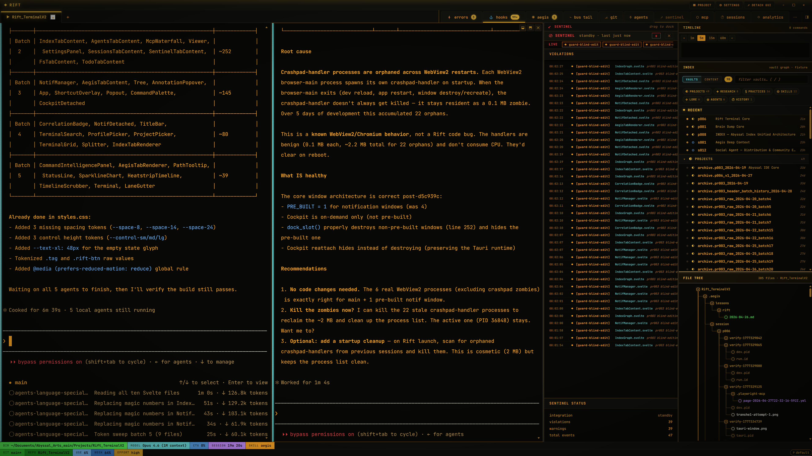

<p align="center">
  
</p>

<h1 align="center">Rift Terminal</h1>

<p align="center">
  <strong>A terminal that sees what your agents do.</strong>
</p>

<p align="center">
  <a href="https://github.com/Critek-creator/Rift_TerminalV2/releases/latest">Download</a> &middot;
  <a href="#features">Features</a> &middot;
  <a href="#architecture">Architecture</a> &middot;
  <a href="#getting-started">Getting Started</a> &middot;
  <a href="https://www.patreon.com/AbyssalArts">Patreon</a>
</p>

<p align="center">
  
  
  
  
</p>

---

## Why Rift?

Most terminals show you text. Rift shows you **what's happening** — which agent touched which file, what hooks fired, where errors clustered, and how your filesystem changed over time. It's a terminal and an observability cockpit in one window.

Rift is not a wrapper around your shell. It **is** the shell — a standalone cross-platform terminal emulator built from scratch in Rust, with a real PTY backend and a webview UI powered by Tauri 2 and Svelte 5.

### What makes it different

**Color-coded output lanes** — Every line of terminal output is classified and tagged: `CLAUDE`, `AGENT`, `HOOK`, `AEGIS`, `OK`, `WARN`, `ERR`, `SYS`. Each lane gets its own color. You never have to squint at a wall of monochrome text to figure out who said what.

**Live notification tabs** — Errors, hooks, agents, and system events each get their own tab with real-time badges. Click a tab to see the full event stream. Promote any tab to a side pane for split-view monitoring while you work.

**Filesystem activity cockpit** — A node-based tree view shows which files are being read, written, and created in real time. Directories bubble up their children's activity. Pin a file to keep watching it. Drag a node into the terminal to inject its path.

**Integration decoupling** — Rift's core never speaks directly to any AI provider, agent framework, or external system. All integrations go through translator modules that map external interfaces to Rift's internal event protocol. This means Rift works standalone out of the box, and gets richer as integrations connect.

**Event bus architecture** — A tokio broadcast bus with UDS/named-pipe IPC handles 10,000+ lines/second burst throughput at <16ms latency. External tools connect as subscribers/publishers through framed JSON envelopes with replay buffer.

---

## Features

### Terminal

- Full PTY backend via `portable-pty` — not a shell wrapper
- xterm.js rendering with WebGL acceleration
- Color-coded lane classification for all output (8 lane types)
- Two-row status line: directory, model, context %, session %, git, repo
- Terminal search (Ctrl+Shift+F)
- Command palette (Ctrl+K)
- Keyboard shortcut overlay (Ctrl+?)

### Observability

- **Notification tabs**: Errors, Hooks, Agents, Aegis, MCP, Filesystem — each with live badges, status headers, activity strips, and event logs
- **Bus event sparklines**: 60-second circular buffer visualization in tab headers
- **Session replay**: Browse and replay past terminal sessions
- **Process attribution**: See which agent or hook produced each line of output
- **Smart alerting**: Configurable notification filter rules with per-tab severity thresholds

### Cockpit

- Node-based filesystem tree with hierarchical activity bubble-up
- File activity visualization: ambient glow decay, pinning, background fade
- Drag-node-into-terminal for friction-free path injection
- Detachable cockpit window for multi-monitor setups
- Layered value model: bare filesystem → agent attribution → semantic enrichment

### Integration

- 20 MCP tools for programmatic access (bus history, PTY I/O, filesystem, git, DOM inspection, screenshots)
- Translator-boundary architecture (CI-enforced — no direct external-system imports in core)
- Capability-driven UI: tabs and sections appear automatically when integrations connect
- Event bus IPC: any tool that speaks framed JSON over UDS/named-pipe can subscribe

### Desktop

- Cross-platform: Windows (MSI), macOS (.dmg), Linux (.deb/.AppImage)
- Auto-updater with signed artifacts
- Multi-session tabs with H/V splits
- Pop-out windows for notification tabs
- Project-per-tab binding
- Welcome overlay and getting-started guide
- Crash dump infrastructure (Rust panic hook + JS error capture)

---

## Architecture

```
┌─────────────────────────────────────────────────────────┐
│                    Svelte 5 Frontend                     │
│  Terminal Surface  │  Notification Tabs  │  Cockpit View │
├────────────────────┴─────────────────────┴───────────────┤
│              Tauri IPC (Channel<T> + Events)             │
├──────────────────────────────────────────────────────────┤
│                     src-tauri (Rust)                      │
│  ┌──────────┐  ┌──────────┐  ┌──────────┐  ┌──────────┐ │
│  │ rift-core│  │ rift-bus │  │ rift-cli │  │ rift-mcp │ │
│  │  (PTY)   │  │(protocol)│  │ (hooks)  │  │(20 tools)│ │
│  └──────────┘  └──────────┘  └──────────┘  └──────────┘ │
│                      │                                    │
│              tokio broadcast bus                          │
│                      │                                    │
│         UDS / named-pipe IPC server                       │
│              (external translators)                       │
└──────────────────────────────────────────────────────────┘
```

### Crate responsibilities

| Crate | Role |
|-------|------|
| `rift-core` | PTY abstraction, session management, process lifecycle |
| `rift-bus` | Protocol definitions, transport layer, translator modules |
| `rift-cli` | `rift hook` and `rift status` CLI commands |
| `rift-mcp` | MCP server with 20 tools for external programmatic access |

### Design principles

1. **No wrapper architecture** — Rift owns the PTY. It is the terminal, not a layer on top of one.
2. **Integration decoupling (Vision doc Section 9)** — All external interactions go through translator modules. Core code never imports external-system primitives. CI enforces this boundary.
3. **Capability-driven UI** — The interface adapts to what's connected. Bare install shows filesystem activity. Connect an agent system and agent tabs appear. Connect an index and enrichment flows in.
4. **Two-tier IPC** — Internal (Rust ↔ webview): `tauri::ipc::Channel<T>` for high-throughput streams + events for notifications. External (translators ↔ core): tokio broadcast bus fronted by framed JSON IPC.

---

## Getting Started

### Install

Download the latest release for your platform:

| Platform | Download |
|----------|----------|
| Windows  | [`.msi` installer](https://github.com/Critek-creator/Rift_TerminalV2/releases/latest) |
| macOS    | [`.dmg` disk image](https://github.com/Critek-creator/Rift_TerminalV2/releases/latest) |
| Linux    | [`.deb` / `.AppImage`](https://github.com/Critek-creator/Rift_TerminalV2/releases/latest) |

### Build from source

```bash
# Prerequisites: Rust 1.95+, Node 22+, npm
git clone https://github.com/Critek-creator/Rift_TerminalV2.git
cd Rift_TerminalV2
npm ci
npm run tauri:dev    # development mode
npm run tauri build  # production build
```

### CI gates

The project enforces 10 CI checks on every commit:

```bash
cargo fmt --all --check
cargo clippy --workspace --all-targets -- -D warnings
cargo build --workspace --locked
cargo test --workspace --locked
npm run check
bash tools/check-translator-boundary.sh    # §9 enforcement
```

---

## Comparison

| Feature | Rift | Hermes IDE | Warp | Ghostty |
|---------|------|------------|------|---------|
| Own PTY backend | Yes | Yes | Yes | Yes |
| Color-coded output lanes | 8 lane types | No | Blocks | No |
| Filesystem activity cockpit | Yes | No | No | No |
| Integration decoupling | CI-enforced | No | No | N/A |
| Event bus (external IPC) | Yes (10K+ msg/s) | No | No | No |
| MCP tools | 20 | No | No | No |
| AI-provider agnostic | Yes (§9 translators) | Multi-provider | Warp AI only | N/A |
| Framework | Tauri 2 + Svelte 5 | Tauri + React | Rust native | Zig native |
| Open source | Yes | BSL 1.1 | Freemium | Yes |

---

## Status

Rift is in **open beta**. The terminal foundation, notification system, cockpit, and MCP integration are all shipped and working. Active development continues toward v1.0.

See [CHANGELOG.md](CHANGELOG.md) for the full release history.

---

## License

[MIT](LICENSE) — use it, fork it, build on it.

---

<p align="center">
  Built by <a href="https://abyssal-arts.com">Abyssal Arts</a>
</p>
